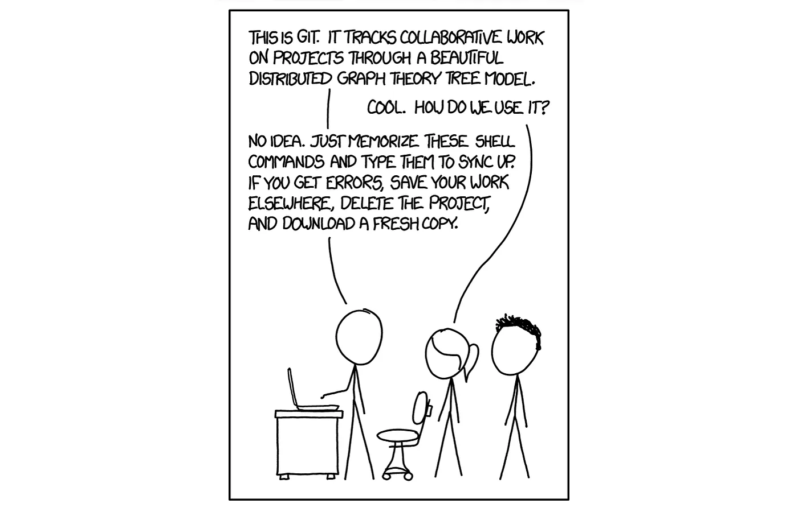
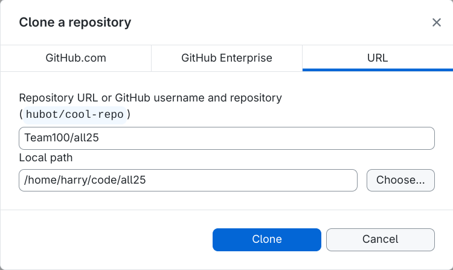
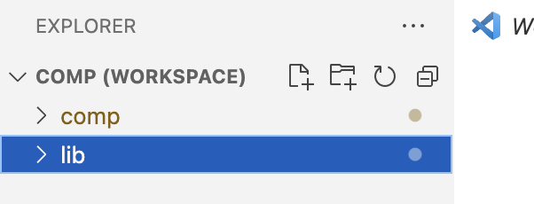

# Setting up WPILib and VS Code

For programming, we need a code editor, tools to build, test, and deploy code. We also need a way to track the version of code and share code among the team.

The [FIRST Robotics Competion](https://www.firstinspires.org/robotics/frc) (FRC) uses the [Worcester Polytechnic Instituate](https://www.wpi.edu/) (WPI) Robotics Library ([WPILib](https://wpilib.org/)) as the standard software library to write code for robots.

Follow the [installation instructions](https://docs.wpilib.org/en/latest/docs/zero-to-robot/step-2/wpilib-setup.html) for your platform (Windows, MacOS, or Linux) to download and execute the latest installer package.

Note: when prompted during the installation process, select the fastest option to download WPILib's VS Code.

[Visual Studio Code](https://code.visualstudio.com/) (VS Code) is an integrated development environment (IDE). If this is your first time using VS Code, follow its [getting started tutorial](https://code.visualstudio.com/docs/getstarted/getting-started).

## GitHub and Git

[GitHub and Git](https://docs.github.com/en/get-started/start-your-journey/about-github-and-git) are used to version control and share code.

Git can be a little hard.



Follow the [installation instructions](https://docs.github.com/en/get-started/learning-to-code/getting-started-with-git#setting-up-your-command-line) and [install GitHub Desktop](https://docs.github.com/en/desktop/installing-and-authenticating-to-github-desktop/installing-github-desktop).

If you are new to `git`, follow the [getting started tutorial](https://docs.github.com/en/get-started/learning-to-code/getting-started-with-git) to understand the basic concepts.

Follow the [GitHub Quickstart Guide](https://docs.github.com/en/get-started/start-your-journey) and the [hello-world](https://docs.github.com/en/get-started/start-your-journey/hello-world) example to understand the concepts of repository, branch, commit, and pull request (PR).

Next, we will use GitHub Desktop to fork the [Team100 repository](https://github.com/Team100/).

## Setting up the Team 100 repository

### Prerequisites

Before we start, make sure you have:

- A computer with internet access
- A GitHub account (if you don't have one, go to [github.com](https://github.com) and sign up)
- Basic familiarity with using a computer (opening programs, clicking buttons, etc.)

### Configure Git (First Time Only)

You need to tell Git who you are. Replace "Your Name" and "<your.email@example.com>" with your actual information:

```shell
git config --global user.name "Your Name"
git config --global user.email "your.email@example.com"
```

### Choose Where to Put Your Code

Decide where you want to keep your robot code. We recommend creating a folder like `code`, `src`, or `github` in your home directory.

**On Windows:**

- Open File Explorer
- Navigate to `C:\Users\YourUsername\`
- Create a new folder called `code`

**On Mac/Linux:**

- Open Terminal
- Type `mkdir ~/code` and press Enter (this creates a folder called "code" in your home directory)

### Clone the Repository

Cloning the repository creates a local, independent copy of the code you can use to experiment. Launch GitHub Desktop, choose "Clone a Repository", and use `Team100/all25` as the repository URL and the directory you chose in the step before as the base path.

.

### Verify Everything Worked

Let's make sure everything downloaded correctly:

1. In GitHub Desktop, you should see `all25` in your repository list
2. Click on `all25` to open it
3. You should see the repository contents
4. Open File Explorer (Windows) or Finder (Mac) and navigate to where you saved the repository
5. You should see folders like `comp`, `lib`, `studies`, `console`, `raspberry_pi`, and `doc`

### Understanding What You Just Downloaded

You now have a complete copy of Team100's 2025 robot code! Here's what each folder contains:

- **`comp/`** - The main competition robot code
- **`lib/`** - Shared library code used by all projects
- **`studies/`** - Small experimental projects and learning exercises (this is where you'll work!)
- **`console/`** - Operator console hardware and software
- **`raspberry_pi/`** - Vision processing and other coprocessor tasks
- **`doc/`** - Documentation (like this file!)

### Set Up Your Development Branch (Optional but Recommended)

Before you start making changes, it's good practice to create your own branch (a separate version of the code where you can make changes without affecting the main code):

1. In GitHub Desktop, make sure you're on the "main" branch (you should see this at the top)
2. Click "Current branch: main" and then "New branch"
3. Name your branch something like "your-name-dev" (replace with your actual name)
4. Click "Create branch"
5. You should now see "Current branch: your-name-dev" at the top

You can use GitHub Desktop and the menu option "Branch > New Branch". Alternatively, you can use a shell to:

1. Create a new branch with your name:

   ```bash
   git checkout -b your-project-name
   ```

   1. Replace "your-name-dev" with something like "alex-dev" or "sarah-dev"
   2. Replace "your-project-name" with what you are trying to accomplish. E.g. for now it can be `learning`

2. Verify you're on your new branch:

   ```bash
   git branch
   ```

   You should see an asterisk (*) next to your branch name

Great job! You now have the `Team100/all25` repository on your computer. The next step is to use VSCode and WPILib to build and test the code.

## Open Workspace in VS Code

In VS Code, go to `File > Open Folder` and select the `all25/comp` folder.

When you open the `comp` project, VS Code should show a message in the bottom-right corner suggesting that you open the "workspace" instead, which includes lib:


When you have VS Code correctly set up, the Explorer view should contain two top-level folders: `comp` and `lib`:



**Important:** You're now working in your own fork of the repository, so any changes you make won't affect the main Team100/all25 repository until you create a Pull Request. See the [contributing doc](./CONTRIBUTING.md) for additional information.

### Building the RoboRIO Code

The main code is written in [Java](https://dev.java/). [Gradle](https://gradle.org/) is a build tool that compiles and packages Java code.

Use the WPI extensions to build the robot code:

1. Press `CTRL + SHIFT + P` to get the VSCode Command Mode.
    1. `CMD + SHIFT + P` on a Mac
1. Search for `WPILib: Build Robot Code`
1. Select `comp` when it asks.
1. A terminal should pop up that runs the build. If successful, you will see this:

    ```shell
    BUILD SUCCESSFUL in 2s``
    6 actionable tasks: 1 executed, 5 up-to-date
    Watched directory hierarchies: [C:\Users\Engineering Student\src\all24\comp\swerve100]
    ```

If this step fails, review the [troubleshooting guide](./TROUBLESHOOTING.md) or contact a mentor.

## Next Steps

You are done setting up your code! It builds successfully so you could start making changes now, if you'd like. If you have a RoboRIO handy, you might want to try to [deploy](README_DEPLOY_TO_ROBORIO.md) to it immediately. But before you do, I recommend learning a bit more about how to work with the FIRST Robotics library, WPILib. There are two paths you can take:

1. [Learn to control a single motor](README_2_MOTOR.md): recommended, this walks you step-by-step on how to get a single motor running through the RoboRIO.
2. [Learn to use the Simulator](README_5_SIMULATOR.md): alternate path, learn to deploy the code to a simulator and do your testing that way.
