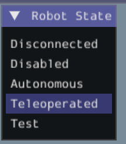

# Using the Simulator
WPI VSCode extensions come with an extensive Simulator that you can use to work on some of your code without having to deploy to a physical robot. While this can't test ALL of the robot systems, it's good to get familiar with it since it can save you a lot of time.

## Simulating the RoboRIO
Use the WPI extensions to kick off the Simulator. Good overall instructions are available [here](https://docs.wpilib.org/en/stable/docs/software/wpilib-tools/robot-simulation/simulation-gui.html). 
1. Press `CTRL + SHIFT + P` to get the VSCode Command Mode.
1. Search for `Simulate Robot Code`
1. Select `comp` when it asks.
1. It will ask you what simulations to run. Make sure `Sim GUI` is selected, and nothing else.
1. You should get the robot simulation GUI, which looks like this:

### Using the Simulator
1. Make sure you have the Field view available. This will allow you to "drive" the robot virtually. If you don't, go to `Network Tables > Field` .
    1. If you don't see the Field view widget/option, make sure your Robot code is running flawlessly (and no breakpoints were hit).
    1. Learn more about using the Field widget [here](https://docs.wpilib.org/en/stable/docs/software/dashboards/glass/field2d-widget.html).
1. Try to drive the Robot. You will need to setup your Keyboard as a Joystick if you haven't yet. 
    1. Click and drag Keyboard 0 to Joystick[0] like this: 
    .
    1. Select `Teleoperated` from the `Robot State` widget.
        1. 
    1. You should be able to use the `A-W-S-D` keys to move in 2 dimensions (Axis 0 and Axis 1).
    1. You should be able to use the `E-R` keys to rotate the robot (Axis 2).
1. Try to put the Robot in autonomous mode. This will cause it to execute known trajectories.
    1. First, let's get debugging working by increasing the Log Level. 
        1. Go to `Network Tables > SmartDashboard > Log Level`.
        
        1. Select `TRACE` level, which should be the maximum
    1. Click on `Autonomous` in the `Robot State` widget.
    1. The robot should start driving around, with these ugly trajectories drawn:
    
    1. Click the Hamburger Menu in the top-right of the field window, select Trajectory, and turn off the Arrows. You should get a nicer one like this:
    

# Next Steps
Congrats, you now know how to work with the Simulator. Let's take on our first real Comp project changes in the [Teleop Readme](README_6_TELEOP.md).