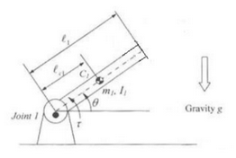

# R Dynamics

Dynamics of a single-DOF revolute arm.

Note gravity direction is wrong in this picture, ours is along x.



The setup is:

* a revolute joint at the origin with angle $q_1$.
* a link of mass $m_1$ centered $l_{c_1}$ from the origin, with inertia $I_{c_1}$ and length $l_1$. 

For things like $sin(q_1)$, we use a shorthand like $s_{1}$

## Mass

The center of mass is just a rotation:

```math
p_{c_1} =
\begin{bmatrix}
l_{c_1} c_1 \\
l_{c_1} s_1\\
0
\end{bmatrix}
```

The translational Jacobian is the derivative:

```math
J_{v_1} =
\begin{bmatrix}
-l_{c_1} s_1  \\
l_{c_1} c_1  \\
0 
\end{bmatrix}
```

The angular Jacobian is rigid rotation:

```math
J_{\omega_1} =
\begin{bmatrix}
0  \\
0  \\
1 
\end{bmatrix}
```

Now we can put all these terms together into the expression for the mass "matrix" (which is scalar in this case):

```math
M =
m_1 J_{v_1}^T J_{v_1}
+
J_{\omega_1}^T I_{c_1} J_{\omega_1}
```

To obtain:

```math
M =
m_1
\begin{bmatrix}
-l_{c_1} s_1 & l_{c_1} c_1 & 0
\end{bmatrix}
\begin{bmatrix}
-l_{c_1} s_1  \\
l_{c_1} c_1  \\
0 
\end{bmatrix}
\\
+
\begin{bmatrix}
0 & 0 & 1
\end{bmatrix}
\begin{bmatrix}
I_{xx_1} & -I_{xy_1} & -I_{xz_1} \\
-I_{yx_1} & I_{yy_1} & -I_{yz_1} \\
-I_{zx_1} & -I_{zy_1} & I_{zz_1} \\
\end{bmatrix}
\begin{bmatrix}
0  \\
0  \\
1 
\end{bmatrix}
```

Which is:

```math
M = 
m_1
l_{c_1}^2 
+
I_{zz_1} 
```

## Centrifugal and Coriolis

For this system, there is no centrifugal/coriolis term.

## Gravity

Start with the expression for gravity:

```math
G = -
\begin{bmatrix}
m_1 g & m_2 g & \cdots m_n g \\
\end{bmatrix}
\begin{bmatrix}
J_{v_1}^T\\
J_{v_2}^T\\
\vdots\\
J_{v_n}^T
\end{bmatrix}
```

So in our case:

```math
G = 
-J_{v_1}^T m_1 g
```

For consistency with the other dynamics formulations,
let's say that gravity acts along the x axis, i.e. the
"zero" of the mechanism is pointing straight up.

```math
g=
\begin{bmatrix}
-g\\
0\\
0
\end{bmatrix}
```

Thus our gravity vector is:

```math
G=
-m_1
\begin{bmatrix}
-l_{c_1} s_1 & l_{c_1} c_1 & 0
\end{bmatrix}
\begin{bmatrix}
-g\\
0\\
0
\end{bmatrix}
```

Or

```math
G = 
-m_1gl_{c_1}s_1
```

## Equation of Motion

Finally (using our corrected gravity expression),
we can write the equation of motion, starting with the definition:

```math
\tau = M(q)\ddot{q} + C(q,\dot{q})\dot{q} + G(q)
```

and substituting the matrices we computed above:


```math
\tau = 
\left(
m_1 l_{c_1}^2 
+ I_{zz_1}
\right)
\ddot{q}
-m_1gl_{c_1}s_1 
```
