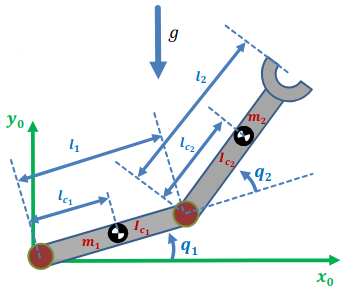

# RR Dynamics

This is the Chemnitz revolute-revolute (RR) example that begins on slide 79.

Note gravity direction is wrong in this picture, ours is along x.



The setup is:

* a revolute joint at the origin with angle $q_1$.
* a link of mass $m_1$ centered $l_{c_1}$ from the origin, with inertia $I_{c_1}$ and length $l_1$. 
* a revolute joint at the end of the first link, with relative angle $q_2$.
* a link of mass $m_2$ centered $l_{c_2}$ from the joint, with inertia $I_{c_2}$ and length $l_2$.

This setup involves the sum of angles, so
for things like $sin(q_1 + q_2)$, we use a shorthand like
$s_{12}$

## Mass

The center of mass of the first link is just a rotation:

```math
p_{c_1} =
\begin{bmatrix}
l_{c_1} c_1 \\
l_{c_1} s_1\\
0
\end{bmatrix}
```

The center of mass of the second link is a rotation added
to wherever the end of the first link is:

```math
p_{c_2} =
\begin{bmatrix}
l_1 c_1 + l_{c_2} c_{12} \\
l_1 s_1 + l_{c_2} s_{12} \\
0
\end{bmatrix}
```

The translational Jacobian for the first link is the
straightforward derivative:

```math
J_{v_1} =
\begin{bmatrix}
-l_{c_1} s_1 & 0 \\
l_{c_1} c_1 & 0 \\
0 & 0
\end{bmatrix}
```

And the same for the second link:

```math
J_{v_2} =
\begin{bmatrix}
- l_1 s_1 - l_{c_2} s_{12}  & -l_{c_2}s_{12} \\
l_1 c_1 + l_{c_2} c_{12}  & l_{c_2}c_{12} \\
0 & 0
\end{bmatrix}
```

The angular Jacobians are very simple, just rigid rotation
of one joint:

```math
J_{\omega_1} =
\begin{bmatrix}
0 & 0 \\
0 & 0 \\
1 & 0
\end{bmatrix}
```

and the sum of the two rotations:

```math
J_{\omega_2} =
\begin{bmatrix}
0 & 0 \\
0 & 0 \\
1 & 1
\end{bmatrix}
```

Now we can put all these terms together into the expression for the mass matrix:

```math
M =
m_1 J_{v_1}^T J_{v_1}
+
J_{\omega_1}^T I_{c_1} J_{\omega_1}
+
m_2 J_{v_2}^T J_{v_2}
+
J_{\omega_2}^T  I_{c_2} J_{\omega_2}
```

To obtain:

```math
M =
m_1
\begin{bmatrix}
-l_{c_1} s_1 & l_{c_1} c_1 & 0 \\
0 & 0  & 0
\end{bmatrix}
\begin{bmatrix}
-l_{c_1} s_1 & 0 \\
l_{c_1} c_1 & 0 \\
0 & 0
\end{bmatrix}
\\
+
\begin{bmatrix}
0 & 0 & 1 \\
0 & 0 & 0
\end{bmatrix}
\begin{bmatrix}
I_{xx_1} & -I_{xy_1} & -I_{xz_1} \\
-I_{yx_1} & I_{yy_1} & -I_{yz_1} \\
-I_{zx_1} & -I_{zy_1} & I_{zz_1} \\
\end{bmatrix}
\begin{bmatrix}
0 & 0 \\
0 & 0 \\
1 & 0
\end{bmatrix}
\\
+
m_2
\begin{bmatrix}
-l_{c_2} s_{12} - l_1 s_1 & l_{c_2} c_{12} + l_1 c_1 & 0\\
-l_{c_2}s_{12}  & l_{c_2}c_{12} & 0
\end{bmatrix}
\begin{bmatrix}
-l_{c_2} s_{12} - l_1 s_1 & -l_{c_2}s_{12} \\
l_{c_2} c_{12} + l_1 c_1 & l_{c_2}c_{12} \\
0 & 0
\end{bmatrix}
\\
+
\begin{bmatrix}
0 & 0 & 1 \\
0 & 0 & 1
\end{bmatrix}
\begin{bmatrix}
I_{xx_2} & -I_{xy_2} & -I_{xz_2} \\
-I_{yx_2} & I_{yy_2} & -I_{yz_2} \\
-I_{zx_2} & -I_{zy_2} & I_{zz_2} \\
\end{bmatrix}
\begin{bmatrix}
0 & 0 \\
0 & 0 \\
1 & 1
\end{bmatrix}
```

Which is:

```math
M = 
m_1
\begin{bmatrix}
l_{c_1}^2 & 0\\
0 & 0
\end{bmatrix}
+
\begin{bmatrix}
I_{zz_1} & 0\\
0 & 0
\end{bmatrix}
+
m_2
\begin{bmatrix}
l_1^2 + 2l_1l_{c_2}c_2 + l_{c_2}^2 & l_1l_{c_2}c_2+l_{c_2}^2\\
l_1l_{c_2}c_2+l_{c_2}^2 & l_{c_2}^2
\end{bmatrix}
+
\begin{bmatrix}
I_{zz_2} & I_{zz_2}\\
I_{zz_2} & I_{zz_2}
\end{bmatrix}
```

So altogether:

```math
M =
\begin{bmatrix}
m_1 l_{c_1}^2 
+ m_2l_1^2 + 2m_2l_1l_{c_2}c_2 + m_2l_{c_2}^2 
+ I_{zz_1}
+ I_{zz_2}
& 
m_2l_1l_{c_2}c_2+m_2l_{c_2}^2 + I_{zz_2}\\
m_2l_1l_{c_2}c_2+m_2l_{c_2}^2 + I_{zz_2}
&
m_2 l_{c_2}^2 + I_{zz_2}
\end{bmatrix}
```

Note that only $q_2$ is involved in $M$ (through $c_2$), so the
derivatives below will be simple:

## Centrifugal and Coriolis


To derive the centrifugal/Coriolis term, start by writing out
the Christoffel symbol permutations:

```math
\Gamma_{111} = {1\over2}
\left( {\partial m_{11} \over \partial q_1}
+ {\partial m_{11} \over \partial q_1}
- {\partial m_{11} \over \partial q_1} \right) = 0
```

```math
\Gamma_{112} = {1\over2}
\left( {\partial m_{11} \over \partial q_2}
+ {\partial m_{12} \over \partial q_1}
- {\partial m_{12} \over \partial q_1} \right) = -m_2l_1l_{c_2}s_2
```

```math
\Gamma_{121} = {1\over2}
\left( {\partial m_{12} \over \partial q_1}
+ {\partial m_{11} \over \partial q_2}
- {\partial m_{21} \over \partial q_1} \right) = -m_2l_1l_{c_2}s_2
```

```math
\Gamma_{122} = {1\over2}
\left( {\partial m_{12} \over \partial q_2}
+ {\partial m_{12} \over \partial q_2}
- {\partial m_{22} \over \partial q_1} \right) = -m_2l_1l_{c_2}s_2
```

```math
\Gamma_{211} = {1\over2}
\left( {\partial m_{21} \over \partial q_1}
+ {\partial m_{21} \over \partial q_1}
- {\partial m_{11} \over \partial q_2} \right) = m_2l_1l_{c_2}s_2
```

```math
\Gamma_{212} = {1\over2}
\left( {\partial m_{21} \over \partial q_2}
+ {\partial m_{22} \over \partial q_1}
- {\partial m_{12} \over \partial q_2} \right) = 0
```

```math
\Gamma_{221} = {1\over2}
\left( {\partial m_{22} \over \partial q_1}
+ {\partial m_{21} \over \partial q_2}
- {\partial m_{21} \over \partial q_2} \right) = 0
```

```math
\Gamma_{222} = {1\over2}
\left( {\partial m_{22} \over \partial q_2}
+ {\partial m_{22} \over \partial q_2}
- {\partial m_{22} \over \partial q_2} \right) = 0
```

Then we can write the $C$ matrix:

```math
C = 
\begin{bmatrix}
-m_2l_1l_{c_2}s_2\dot{q_2} & -m_2l_1l_{c_2}s_2\dot{q_1} -m_2l_1l_{c_2}s_2\dot{q_2}  \\
m_2l_1l_{c_2}s_2\dot{q_1} & 0
\end{bmatrix}
```

## Gravity

Start with the expression for gravity:

```math
G = -
\begin{bmatrix}
m_1 g & m_2 g & \cdots m_n g \\
\end{bmatrix}
\begin{bmatrix}
J_{v_1}^T\\
J_{v_2}^T\\
\vdots\\
J_{v_n}^T
\end{bmatrix}
```

So in our case:

```math
G = 
-J_{v_1}^T m_1 g  
- J_{v_2}^T m_2 g
```

Our gravity acts along the x axis:

```math
g=
\begin{bmatrix}
-g\\
0\\
0
\end{bmatrix}
```

Thus our gravity vector is:

```math
G=
-m_1
\begin{bmatrix}
-l_{c_1} s_1 & l_{c_1} c_1 & 0 \\
0 & 0 & 0
\end{bmatrix}
\begin{bmatrix}
-g\\
0\\
0
\end{bmatrix}

-m_2
\begin{bmatrix}
-l_{c_2} s_{12} - l_1 s_1 & l_{c_2} c_{12} + l_1 c_1 & 0  \\
-l_{c_2}s_{12}  & l_{c_2}c_{12} & 0
\end{bmatrix}
\begin{bmatrix}
-g\\
0\\
0
\end{bmatrix}
```

Or

```math
G = 
\begin{bmatrix}
-m_1gl_{c_1}s_1 - m_2g(l_{c_2}s_{12} + l_1s_1)\\
-m_2gl_{c_2}s_{12}
\end{bmatrix}
```


## Equation of Motion

Finally (using our corrected gravity expression),
we can write the equation of motion, starting with the definition:

```math
\tau = M(q)\ddot{q} + C(q,\dot{q})\dot{q} + G(q)
```

and substituting the matrices we computed above:

```math
\tau = 
\begin{bmatrix}
m_1 l_{c_1}^2 
+ m_2l_1^2 + 2m_2l_1l_{c_2}c_2 + m_2l_{c_2}^2 
+ I_{zz_1}
+ I_{zz_2}
& 
m_2l_1l_{c_2}c_2+m_2l_{c_2}^2 + I_{zz_2}\\
m_2l_1l_{c_2}c_2+m_2l_{c_2}^2 + I_{zz_2}
&
m_2 l_{c_2}^2 + I_{zz_2}
\end{bmatrix}
\ddot{q}
\\
+
\begin{bmatrix}
-m_2l_1l_{c_2}s_2\dot{q_2} & -m_2l_1l_{c_2}s_2\dot{q_1} -m_2l_1l_{c_2}s_2\dot{q_2}  \\
m_2l_1l_{c_2}s_2\dot{q_1} & 0
\end{bmatrix}
\dot{q}
\\
+
\begin{bmatrix}
-m_1gl_{c_1}s_1 - m_2g(l_{c_2}s_{12} + l_1s_1)\\
-m_2gl_{c_2}s_{12}
\end{bmatrix}

```


The mass term contains cosine of the second joint: the intuition
is that the interaction between the axes is maximum when the arm
is fully extended.

The Coriolis term contains the sine, so the intuition is that the
Coriolis and centrifugal effects are maximum when the links are
perpendicular.