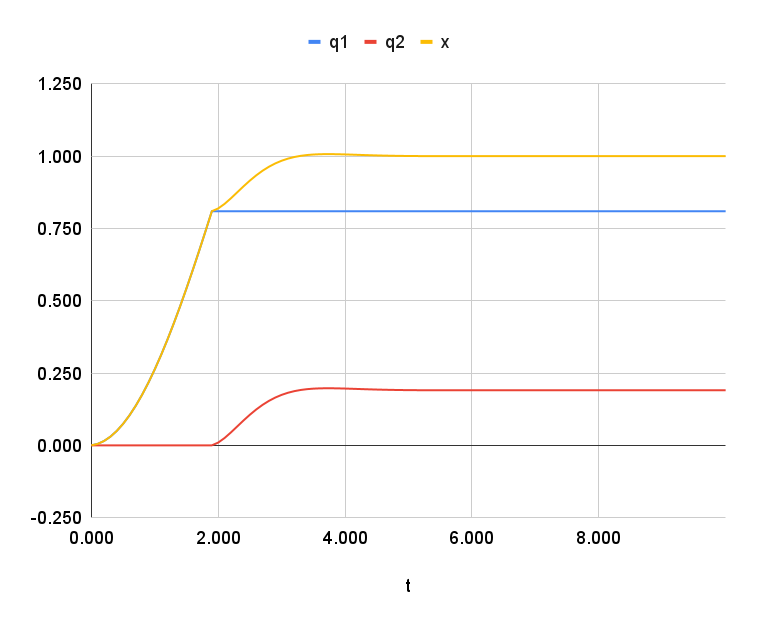
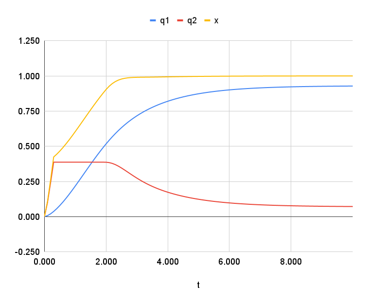
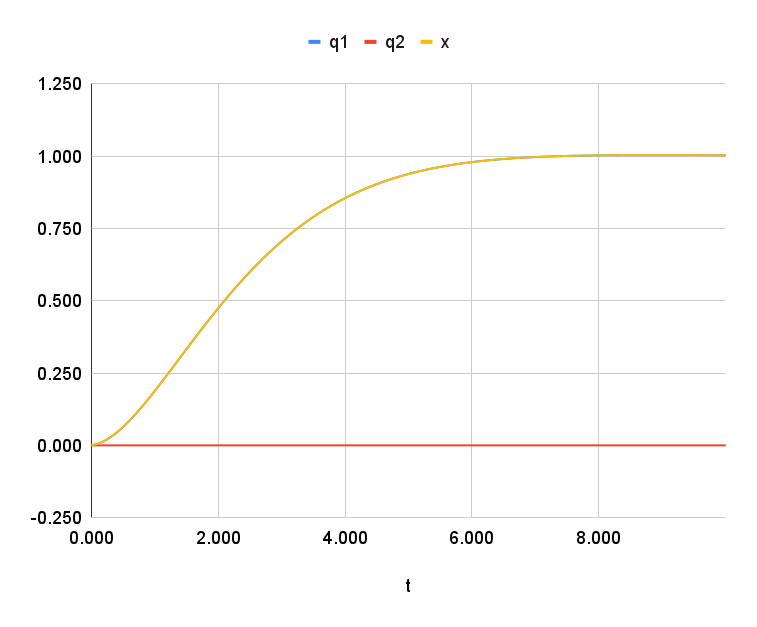
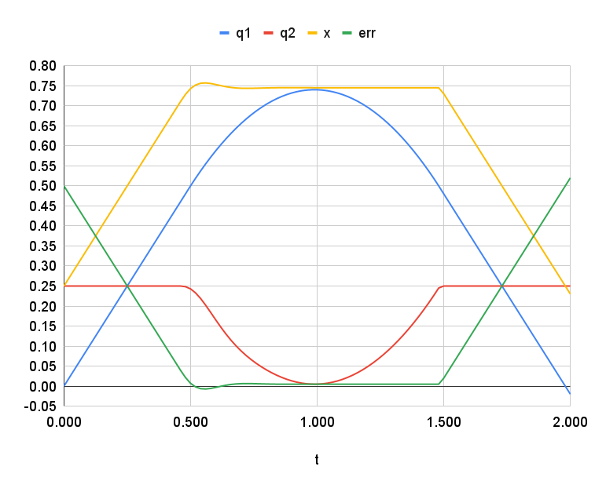
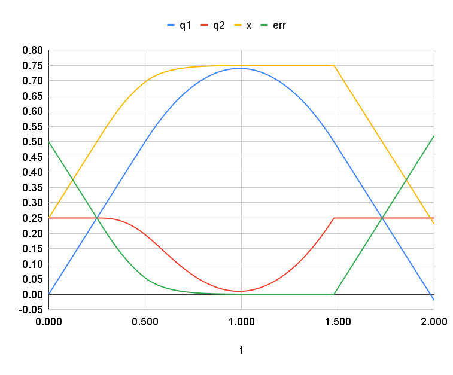
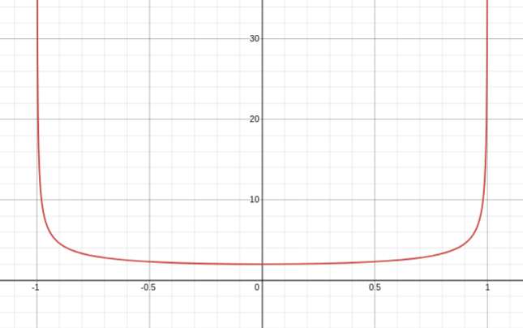

# 2P Parallel

This is a study of control of two parallel prismatic joints, the simplest "redundant" mechanism,
to prepare for a more thorough analysis of the complete control problem -- drivetrain and
mechanism together.  In the Calgames mech, this would be six DOF: PPRPRR.

## Use Cases

Why would we want redundant joints?  One reason is to allow "coarse" and "fine" joints:
the drivetrain could execute "coarse" motion (large, slow, approximate) and the
mechanism could execute "fine" motion (small, quick, accurate).
([spreadsheet](https://docs.google.com/spreadsheets/d/1Z7twUzL8mwdp5JcAuysRHhibZrmlWo9Cy3-zGcI3sXY/edit?gid=1682330556#gid=1682330556)):

### Tolerance

A simple use case involves tolerances: within the loose tolerance of the coarse joint,
the fine joint does all the work:



This might be applicable for the case where the drivetrain gets "close enough" to a target,
and then stops, to avoid upsetting a mechanism that's moving the rest of the way.

### Cascaded PID

A simple use case is cascaded PID control: the coarse joint responds relatively
slowly, and the fine joint responds more quickly, within its limits:



The control scheme here is very simple, just "P" and "D," but it compares favorably to the same
coarse control, with the same "P" value, (but more "D" to avoid oscillation) by itself:



The main benefit of this approach is simplicity.

### Linger

This scenario uses a fixed trajectory for the coarse axis, with a PID controller
on the fine axis, to produce a long linger time at the target (e.g. to do some task).
Here $q_1$ represents the drive base, executing a constant-acceleration U-turn, and $q_2$
represents a mechanism driven to linger at the target for as long as possible.
Here the target is $0.75$, $q_1$ turns around with acceleration $2 m/s^2$, just
momentarily touching the target, and $q_2$ is uses a PD controller to maintain
$x$ within 0.01 m of the target for about 1 second.



In this chart, you can see the $q_2$ axis reaching forward at its
limit until the target is reached, and then $q_2$ mirrors $q_1$.

Since $q_1$ is moving fast when $q_2$ begins moving, the $q_2$
acceleration determines the size of the little overshoot: in this
example, $q_2$ responds very fast.

This scheme also works if $q_2$ responds more slowly, though
the arrival on target is not quite as crisp.  Notice
how $q_2$ anticipates the movement required (just by using
a softer P).  The transition moving the other way is sudden,
as $q_2$ hits some sort of physical hard stop.



## What to do

The use cases above are all hierarchical: the two joints have
different purposes, and are controlled separately.  As such,
the conventional redundant control principles aren't really
required.

Instead, just control them as a cascade?

Details of conventional redundant control follow.

<hr>
<hr>
<hr>
<hr>

## Kinematics

Redundant mechanisms have nonunique inverse kinematics, so the problem needs to be solved
as some sort of constrained optimization.

The forward kinematics are trivial, for joint configurations $q_1$ and $q_2$, and end-effector position $x$:

```math
x = q_1 + q_2
```

To solve the underdetermined inverse kinematics, there are some trivial options, for example the
joints could split the distance:

```math
q_1 = \tfrac{x}{2}
\\
q_2 = \tfrac{x}{2}
```
Another trivial option is for the first joint to do all the work:

```math
q_1 = x
\\
q_2 = 0
```

In general, the problem is of the form

```math
A q = x
```

where

```math
A = 
\begin{bmatrix}
1 && 1
\end{bmatrix}
```

and the solution is of the form:

```math
q = q_p + q_n
```

where $q_p$ is a any particular solution, for example,
the first one above:

```math
q =
\begin{bmatrix} 
\frac{x}{2}
\\
\space
\\
\frac{x}{2}
\end{bmatrix}
```

and $q_n$ is any vector from the null space.  The null space
$\bold{N}(A)$ of $A$ has basis

```math
q =
\begin{bmatrix} 
-1
\\
\space
\\
1
\end{bmatrix}
```

So the complete solution involves a parameter, $s$:

```math
q =
\begin{bmatrix} 
\frac{x}{2}
\\
\space
\\
\frac{x}{2}
\end{bmatrix}
+
s
\begin{bmatrix} 
-1
\\
\space
\\
1
\end{bmatrix}

```

or, equivalently:

```math
q_1 = \frac{x}{2} - s
\\
\space
\\
q_2 = \frac{x}{2} + s

```

To express the limits on $q_2$ in the use cases above,
we could use a cost function with a soft minimum at the center of motion, and steep penalty near the
edges ([desmos](https://www.desmos.com/calculator/2l6ta0osg7)):



Using this cost function alone would yield the same answer as the trivial case above:
$q_1$ would do all the work.

## Control

For a trajectory in $x$, we have two control strategies.

* For the drivetrain, $q_1$, we take the sum of velocity feedforward and proportional
position feedback, supplied to a low-level velocity controller.
* For the mechanism, $q_2$, we supply the positional setpoint directly to a low-level
position controller, with the velocity feedforward as an extra voltage.

TODO: finish this section

## Reference

* [paper about redundant manipulator IK](https://www.mdpi.com/2227-7390/13/4/624)
* [FABRIK paper](http://www.andreasaristidou.com/publications/papers/FABRIK.pdf)