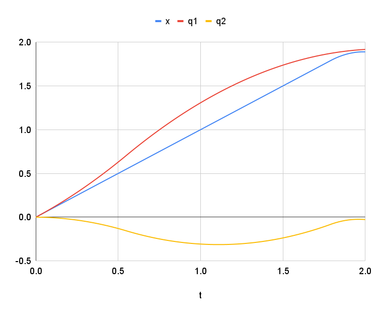

# 2P Parallel

This is a study of control of two parallel prismatic joints, the simplest "redundant" mechanism.

## Trajectories

Why would we want redundant joints?  One reason is to allow "coarse" and "fine" joints:
the drivetrain could execute "coarse" motion (large, slow, approximate) and the
mechanism could execute "fine" motion (small, quick, accurate).

Here's a use case for this capability: coming to a stop with higher acceleration than
the "coarse" mechanism can manage ([spreadsheet](https://docs.google.com/spreadsheets/d/1Z7twUzL8mwdp5JcAuysRHhibZrmlWo9Cy3-zGcI3sXY/edit?gid=1682330556#gid=1682330556)):



In this example, the coarse joint, $q_1$, anticipates the approaching stop by
accelerating ahead of $x$, and then brakes gently for the rest of the time.
The fine joint, $q_2$, is capable of much faster acceleration, and so makes
up the difference.

Another use case is cascaded PID control: the coarse joint responds relatively
slowly, and the fine joint responds more quickly:

## Kinematics

Redundant mechanisms have nonunique inverse kinematics, so the problem needs to be solved
as some sort of constrained optimization.

The forward kinematics are trivial, for joint configurations $q_1$ and $q_2$, and end-effector position $x$:

```math
x = q_1 + q_2
```

To solve the underdetermined inverse kinematics, there are some trivial options, for example the
joints could split the distance:

```math
q_1 = \tfrac{x}{2}
\\
q_2 = \tfrac{x}{2}
```
Another trivial option is for the first joint to do all the work:

```math
q_1 = x
\\
q_2 = 0
```

A more realistic case might involve "coarse" and "fine" joints -- for example, $q_1$ could
be a robot drivetrain, and $q_2$ could be an attached mechanism.  In this case, the range
of motion of $q_1$ is essentially unlimited, but $q_2$ has limits that could be expressed
as a cost function, with a soft minimum at the center of motion, and steep penalty near the
edges ([desmos](https://www.desmos.com/calculator/2l6ta0osg7)):


Using this cost function alone would yield the same answer as the trivial case above:
$q_1$ would do all the work.

## Control

For a trajectory in $x$, we have two control strategies.

* For the drivetrain, $q_1$, we take the sum of velocity feedforward and proportional
position feedback, supplied to a low-level velocity controller.
* For the mechanism, $q_2$, we supply the positional setpoint directly to a low-level
position controller, with the velocity feedforward as an extra voltage.


## Reference

* [paper about redundant manipulator IK](https://www.mdpi.com/2227-7390/13/4/624)
* [FABRIK paper](http://www.andreasaristidou.com/publications/papers/FABRIK.pdf)