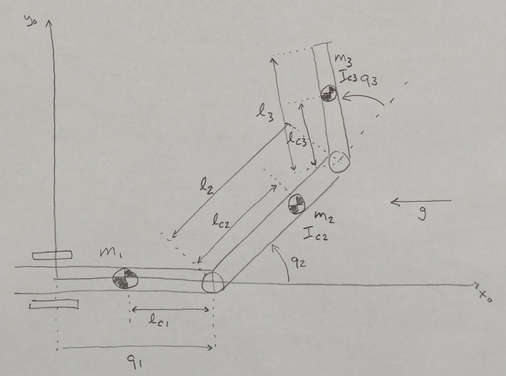

# PRR Dynamics

This covers a three-jointed, prismatic-revolute-revolute (PRR) mechanism.



The setup is:

* a prismatic joint at the origin, parameterized by $q_1$, the distance to the second joint.
* a link of mass $m_1$ centered $l_{c_1}$ from the far end (so that $l_{c_1}$ doesn't depend on $q_1$), with inertia $I_{c_1}$.
* a revolute joint parameterized by $q_2$, the angle measured from the x axis.
* a link of mass $m_2$ centered at $l_{c_2}$ from the joint, with inertia $I_{c_2}$ and length $l_2$.
* a revolute joint parameterized by $q_3$, the angle relative to the second link.
* a link of mass $m_3$ centered at $l_{c_3}$ from the joint, with inertia $I_{c_3}$ and lengh $l_3$.

Remember that expressions like $c_{23}$ mean $cosine(q_2+q_3)$

## Mass

Start with the positions of the centers of mass, $p_{c_1}$, $p_{c_2}$, and $p_{c_3}$.

The first link is just like the PR example:

```math
p_{c_1} =
\begin{bmatrix}
q_1 - l \\
0\\
0
\end{bmatrix}
```

The second link is also identical to the PR example (with different notation):

```math
p_{c_2} =
\begin{bmatrix}
q_1 + l_{c_2} c_2\\
l_{c_2} s_2\\
0
\end{bmatrix}
```

The third link is similar to the second link in the RR example:

```math
p_{c_3} =
\begin{bmatrix}
q_1  + l_2 c_2 + l_{c_3} c_{23} \\
l_2 s_2 + l_{c_3} s_{23} \\
0
\end{bmatrix}
```

The translational center-of-mass Jacobians are as follows:

The first link depends only on the first joint:

```math
J_{v_1} =
\begin{bmatrix}
1 & 0 & 0 \\
0 & 0 & 0 \\
0 & 0 & 0
\end{bmatrix}
```

The second link depends translationally on the first joint
and rotationally on the second joint:

```math
J_{v_2} =
\begin{bmatrix}
1 & -l_{c_2} s_2 & 0 \\
0 & l_{c_2} c_2 & 0 \\
0 & 0 & 0
\end{bmatrix}
```

And finally the third link:

```math
J_{v_3} =
\begin{bmatrix}
1 & -l_2 s_2 - l_{c_3} s_{23} & -l_{c_3}s_{23} \\
0 & l_2 c_2 + l_{c_3} c_{23}  & l_{c_3}c_{23} \\
0 & 0 & 0
\end{bmatrix}
```

And the angular center-of-mass Jacobians: all rotations are around Z,
so there are only values in the last row.

The first rotational Jacobian is always zero since the first joint is prismatic.

```math
J_{\omega_1} =
\begin{bmatrix}
0 & 0 & 0 \\
0 & 0 & 0 \\
0 & 0 & 0
\end{bmatrix}
```

The second rotation Jacobian is identical to the second PR link:

```math
J_{\omega_2} =
\begin{bmatrix}
0 & 0 & 0 \\
0 & 0 & 0 \\
0 & 1 & 0 
\end{bmatrix}
```

The last rotation sums the two joints:

```math
J_{\omega_3} =
\begin{bmatrix}
0 & 0 & 0 \\
0 & 0 & 0 \\
0 & 1 & 1
\end{bmatrix}
```

Now we can put all these terms together into the expression for the mass matrix:

```math
M =
m_1 J_{v_1}^T J_{v_1}
+
J_{\omega_1}^T I_{c_1} J_{\omega_1}
+
m_2 J_{v_2}^T J_{v_2}
+
J_{\omega_2}^T  I_{c_2} J_{\omega_2}
+
m_3 J_{v_3}^T J_{v_3}
+
J_{\omega_3}^T  I_{c_3} J_{\omega_3}
```

To obtain:

```math
M =
m_1
\begin{bmatrix}
1 & 0 & 0 \\
0 & 0 & 0 \\
0 & 0 & 0
\end{bmatrix}
\begin{bmatrix}
1 & 0 & 0 \\
0 & 0 & 0 \\
0 & 0 & 0
\end{bmatrix}
\\
+
\begin{bmatrix}
0 & 0 & 0 \\
0 & 0 & 0 \\
0 & 0 & 0
\end{bmatrix}
I_{c1}
\begin{bmatrix}
0 & 0 & 0 \\
0 & 0 & 0 \\
0 & 0 & 0
\end{bmatrix}
\\
+
m_2
\begin{bmatrix}
1 & 0 & 0 \\
-l_{c_2} s_2  & l_{c_2} c_2 & 0 \\
0 & 0 & 0
\end{bmatrix}
\begin{bmatrix}
1 & -l_{c_2} s_2 & 0 \\
0 & l_{c_2} c_2 & 0 \\
0 & 0 & 0
\end{bmatrix}
\\
+
\begin{bmatrix}
0 & 0 & 0 \\
0 & 0 & 1 \\
0 & 0 & 0 
\end{bmatrix}
\begin{bmatrix}
I_{xx_2} & -I_{xy_2} & -I_{xz_2} \\
-I_{yx_2} & I_{yy_2} & -I_{yz_2} \\
-I_{zx_2} & -I_{zy_2} & I_{zz_2} \\
\end{bmatrix}
\begin{bmatrix}
0 & 0 & 0 \\
0 & 0 & 0 \\
0 & 1 & 0 
\end{bmatrix}
\\
+
m_3
\begin{bmatrix}
1 & 0 & 0 \\
-l_2 s_2 - l_{c_3} s_{23} & l_2 c_2 + l_{c_3} c_{23}  & 0 \\
-l_{c_3}s_{23} & l_{c_3}c_{23} & 0
\end{bmatrix}
\begin{bmatrix}
1 & -l_2 s_2 - l_{c_3} s_{23} & -l_{c_3}s_{23} \\
0 & l_2 c_2 + l_{c_3} c_{23}  & l_{c_3}c_{23} \\
0 & 0 & 0
\end{bmatrix}
\\
+
\begin{bmatrix}
0 & 0 & 0 \\
0 & 0 & 1 \\
0 & 0 & 1
\end{bmatrix}
\begin{bmatrix}
I_{xx_3} & -I_{xy_3} & -I_{xz_3} \\
-I_{yx_3} & I_{yy_3} & -I_{yz_3} \\
-I_{zx_3} & -I_{zy_3} & I_{zz_3} \\
\end{bmatrix}
\begin{bmatrix}
0 & 0 & 0 \\
0 & 0 & 0 \\
0 & 1 & 1
\end{bmatrix}
```

Which is:

```math
M =
m_1
\begin{bmatrix}
1 & 0 & 0 \\
0 & 0 & 0 \\
0 & 0 & 0
\end{bmatrix}
+
\begin{bmatrix}
0 & 0 & 0 \\
0 & 0 & 0 \\
0 & 0 & 0
\end{bmatrix}
\\
+
m_2
\begin{bmatrix}
1 & -l_{c_2}s_2 & 0 \\
-l_{c_2}s_2 & l_{c_2}^2 & 0 \\
0 & 0 & 0
\end{bmatrix}
+
\begin{bmatrix}
0 & 0 & 0 \\
0 & I_{zz_2} & 0 \\
0 & 0 & 0
\end{bmatrix}
\\
+
m_3
\begin{bmatrix}
1 & -l_2 s_2 - l_{c_3} s_{23}  & -l_{c_3}s_{23} \\
-l_2 s_2 - l_{c_3} s_{23} & l_2^2 + 2l_2l_{c_3}c_3 + l_{c_3}^2 & l_{c_3}^2 + l_2l_{c_3}c_3 \\
-l_{c_3}s_{23} & l_{c_3}^2 + l_2l_{c_3}c_3 & l_{c_3}^2
\end{bmatrix}
+
\begin{bmatrix}
0 & 0 & 0 \\
0 & I_{zz_3} & I_{zz_3} \\
0 & I_{zz_3} & I_{zz_3}
\end{bmatrix}
```

The $m_3$ component makes use of the identity,
```math
cos(a)cos(b)+sin(a)sin(b) = cos(a-b)
```
 
to simplify
```math
c_2c_{23} + s_2s_{23} = c_3
```

Simplifying a bit further:

```math
M = 
\begin{bmatrix}
m_1 & 0 & 0 \\
0 & 0 & 0 \\
0 & 0 & 0
\end{bmatrix}
+
\begin{bmatrix}
m_2 & -m_2l_{c_2}s_2 & 0 \\
-m_2l_{c_2}s_2 & m_2l_{c_2}^2 +  I_{zz_2} & 0 \\
0 & 0 & 0
\end{bmatrix}
\\
+
\begin{bmatrix}
m_3 & -m_3l_2 s_2 - m_3l_{c_3} s_{23}  & -m_3l_{c_3}s_{23} \\
-m_3l_2 s_2 - m_3l_{c_3} s_{23} & m_3l_2^2 + m_32l_2l_{c_3}c_3 + m_3l_{c_3}^2 + I_{zz_3}& m_3l_{c_3}^2 + m_3l_2l_{c_3}c_3 + I_{zz_3}\\
-m_3l_{c_3}s_{23} & m_3l_{c_3}^2 + m_3l_2l_{c_3}c_3 + I_{zz_3} & m_3l_{c_3}^2 + I_{zz_3}
\end{bmatrix}
```

And then finally, the terms of the mass matrix, written out individually so it's
easier to read:

```math
m_{11} = m_1 + m_2 + m_3
```

```math
m_{12} = -m_2l_{c_2}s_2 -m_3l_2 s_2 - m_3l_{c_3} s_{23} 
```

```math
m_{13} = -m_3l_{c_3}s_{23} 
```

```math
m_{21} = -m_2l_{c_2}s_2 -m_3l_2 s_2 - m_3l_{c_3} s_{23} = m_{12}
```

```math
m_{22} = m_2l_{c_2}^2 +  I_{zz_2} + m_3l_2^2 + m_32l_2l_{c_3}c_3 + m_3l_{c_3}^2 + I_{zz_3}
```

```math
m_{23} = m_3l_{c_3}^2 + m_3l_2l_{c_3}c_3 + I_{zz_3}
```

```math
m_{31} = -m_3l_{c_3}s_{23} = m_{13}
```

```math
m_{32} = m_3l_{c_3}^2 + m_3l_2l_{c_3}c_3 + I_{zz_3} = m_{23}
```

```math
m_{33} = m_3l_{c_3}^2 + I_{zz_3}
```

## Centrifugal and Coriolis

To compute the Coriolis matrix, $C$, we start with the Christoffel symbols.
There are 27 of them (!), but they are not all unique.  Also,
the partial derivatives with respect to $q_1$ are always zero, as are
partial derivatives of $m_{11}$ and $m_{33}$.

$m_{11}$ is constant:
```math
\Gamma_{111} = {1\over2}
\left( {\partial m_{11} \over \partial q_1}
+ {\partial m_{11} \over \partial q_1}
- {\partial m_{11} \over \partial q_1} \right)
= {1\over2}  {\partial m_{11} \over \partial q_1}
= 0
```
```math
\Gamma_{112} = {1\over2}
\left( {\partial m_{11} \over \partial q_2}
+ {\partial m_{12} \over \partial q_1}
- {\partial m_{12} \over \partial q_1} \right)
= {1\over2}{\partial m_{11} \over \partial q_2} 
= 0
```
```math
\Gamma_{113} = {1\over2}
\left( {\partial m_{11} \over \partial q_3}
+ {\partial m_{13} \over \partial q_1}
- {\partial m_{13} \over \partial q_1} \right) 
= {1\over2} {\partial m_{11} \over \partial q_3}
= 0
```

$m_{12}$
```math
\Gamma_{121} = {1\over2}
\left( {\partial m_{12} \over \partial q_1}
+ {\partial m_{11} \over \partial q_2}
- {\partial m_{21} \over \partial q_1} \right)
= {1\over2}{\partial m_{11} \over \partial q_2}
= \Gamma_{112} 
= 0
```
```math
\Gamma_{122} = {1\over2}
\left( {\partial m_{12} \over \partial q_2}
+ {\partial m_{12} \over \partial q_2}
- {\partial m_{22} \over \partial q_1} \right)
= {\partial m_{12} \over \partial q_2}
= -m_2l_{c_2}c_2 - m_3l_2c_2 - m_3l_{c_3}c_{23}
```
```math
\Gamma_{123} = {1\over2}
\left( {\partial m_{12} \over \partial q_3}
+ {\partial m_{13} \over \partial q_2}
- {\partial m_{23} \over \partial q_1} \right)
= {1\over2} \left( {\partial m_{12} \over \partial q_3}
+ {\partial m_{13} \over \partial q_2} \right)
= -m_3l_{c_3}c_{23}
```

$m_{13}$
```math
\Gamma_{131} = {1\over2}
\left( {\partial m_{13} \over \partial q_1}
+ {\partial m_{11} \over \partial q_3}
- {\partial m_{31} \over \partial q_1} \right)
= {1\over2} {\partial m_{11} \over \partial q_3}
= \Gamma_{113} 
= 0
```
```math
\Gamma_{132} = {1\over2}
\left( {\partial m_{13} \over \partial q_2}
+ {\partial m_{12} \over \partial q_3}
- {\partial m_{32} \over \partial q_1} \right)
= {1\over2}
\left( {\partial m_{13} \over \partial q_2}
+ {\partial m_{12} \over \partial q_3} \right)
= \Gamma_{123}
= -m_3l_{c_3}c_{23}
```
```math
\Gamma_{133} = {1\over2}
\left( {\partial m_{13} \over \partial q_3}
+ {\partial m_{13} \over \partial q_3}
- {\partial m_{33} \over \partial q_1} \right)
= 
{\partial m_{13} \over \partial q_3}
= -m_3l_{c_3}c_{23}
```

$m_{21}$
```math
\Gamma_{211} = {1\over2}
\left( {\partial m_{21} \over \partial q_1}
+ {\partial m_{21} \over \partial q_1}
- {\partial m_{11} \over \partial q_2} \right)
= 
- {1\over2} {\partial m_{11} \over \partial q_2}
= 0
```
```math
\Gamma_{212} = {1\over2}
\left( {\partial m_{21} \over \partial q_2}
+ {\partial m_{22} \over \partial q_1}
- {\partial m_{12} \over \partial q_2} \right)
= 0
```
```math
\Gamma_{213} = {1\over2}
\left( {\partial m_{21} \over \partial q_3}
+ {\partial m_{23} \over \partial q_1}
- {\partial m_{13} \over \partial q_2} \right)
= {1\over2} \left( {\partial m_{21} \over \partial q_3}
- {\partial m_{13} \over \partial q_2} \right)
= 0
```

$m_{22}$
```math
\Gamma_{221} = {1\over2}
\left( {\partial m_{22} \over \partial q_1}
+ {\partial m_{21} \over \partial q_2}
- {\partial m_{21} \over \partial q_2} \right)
= 0
```
```math
\Gamma_{222} = {1\over2}
\left( {\partial m_{22} \over \partial q_2}
+ {\partial m_{22} \over \partial q_2}
- {\partial m_{22} \over \partial q_2} \right)
= {1\over2} {\partial m_{22} \over \partial q_2}
= 0
```
```math
\Gamma_{223} = {1\over2}
\left( {\partial m_{22} \over \partial q_3}
+ {\partial m_{23} \over \partial q_2}
- {\partial m_{23} \over \partial q_2} \right)
= {1\over2} {\partial m_{22} \over \partial q_3}
= -m_3l_2l_{c_3}s_3
```

$m_{23}$
```math
\Gamma_{231} = {1\over2}
\left( {\partial m_{23} \over \partial q_1}
+ {\partial m_{21} \over \partial q_3}
- {\partial m_{31} \over \partial q_2} \right)
=
{1\over2}
\left( {\partial m_{21} \over \partial q_3}
- {\partial m_{31} \over \partial q_2} \right)
= \Gamma_{213}
= 0
```
```math
\Gamma_{232} = {1\over2}
\left( {\partial m_{23} \over \partial q_2}
+ {\partial m_{22} \over \partial q_3}
- {\partial m_{32} \over \partial q_2} \right)
= {1\over2} {\partial m_{22} \over \partial q_3}
= \Gamma_{223} 
= -m_3l_2l_{c_3}s_3
```
```math
\Gamma_{233} = {1\over2}
\left( {\partial m_{23} \over \partial q_3}
+ {\partial m_{23} \over \partial q_3}
- {\partial m_{33} \over \partial q_2} \right)
= 
{\partial m_{23} \over \partial q_3}
= -m_3l_2l_{c_3}s_3
```

$m_{31}$
```math
\Gamma_{311} = {1\over2}
\left( {\partial m_{31} \over \partial q_1}
+ {\partial m_{31} \over \partial q_1}
- {\partial m_{11} \over \partial q_3} \right)
=
 - {1\over2} {\partial m_{11} \over \partial q_3}
= 0
```
```math
\Gamma_{312} = {1\over2}
\left( {\partial m_{31} \over \partial q_2}
+ {\partial m_{32} \over \partial q_1}
- {\partial m_{12} \over \partial q_3} \right)
=
{1\over2}\left( {\partial m_{31} \over \partial q_2}
- {\partial m_{12} \over \partial q_3} \right)
= 0
```
```math
\Gamma_{313} = {1\over2}
\left( {\partial m_{31} \over \partial q_3}
+ {\partial m_{33} \over \partial q_1}
- {\partial m_{13} \over \partial q_3} \right)
= 0
```

$m_{32}$
```math
\Gamma_{321} = {1\over2}
\left( {\partial m_{32} \over \partial q_1}
+ {\partial m_{31} \over \partial q_2}
- {\partial m_{21} \over \partial q_3} \right)
= {1\over2} \left( {\partial m_{31} \over \partial q_2}
- {\partial m_{21} \over \partial q_3} \right)
= 0
```
```math
\Gamma_{322} = {1\over2}
\left( {\partial m_{32} \over \partial q_2}
+ {\partial m_{32} \over \partial q_2}
- {\partial m_{22} \over \partial q_3} \right)
= 
{\partial m_{32} \over \partial q_2}
- {1\over2}{\partial m_{22} \over \partial q_3}
= m_3l_2l_{c_3}s_3
```
```math
\Gamma_{323} = {1\over2}
\left( {\partial m_{32} \over \partial q_3}
+ {\partial m_{33} \over \partial q_2}
- {\partial m_{23} \over \partial q_3} \right)
= {1\over2} {\partial m_{33} \over \partial q_2}
= 0
```

$m_{33}$
```math
\Gamma_{331} = {1\over2}
\left( {\partial m_{33} \over \partial q_1}
+ {\partial m_{31} \over \partial q_3}
- {\partial m_{31} \over \partial q_3} \right)
= 0
```
```math
\Gamma_{332} = {1\over2}
\left( {\partial m_{33} \over \partial q_2}
+ {\partial m_{32} \over \partial q_3}
- {\partial m_{32} \over \partial q_3} \right)
= {1\over2} {\partial m_{33} \over \partial q_2} 
= \Gamma_{323}
= 0
```
```math
\Gamma_{333} = {1\over2}
\left( {\partial m_{33} \over \partial q_3}
+ {\partial m_{33} \over \partial q_3}
- {\partial m_{33} \over \partial q_3} \right)
= {1\over2} {\partial m_{33} \over \partial q_3}
= 0
```

So recalling the elements of the $C$ matrix are summed over $k$:

```math
c_{ij} =
\sum\limits_{k=1}^{n} \Gamma_{ijk}(q)\dot{q_k}
```

```math
c_{11} = 0
```

```math
c_{12} = -m_2l_{c_2}c_2\dot{q}_2 - m_3l_2c_2\dot{q}_2 - m_3l_{c_3}c_{23}\dot{q}_2  -m_3l_{c_3}c_{23} \dot{q}_3
```

```math
c_{13} = -m_3l_{c_3}c_{23} \dot{q}_2  -m_3l_{c_3}c_{23} \dot{q}_3
```

```math
c_{21} = 0
```

```math
c_{22} = -m_3l_2l_{c_3}s_3 \dot{q}_3
```

```math
c_{23} = -m_3l_2l_{c_3}s_3 \dot{q}_2 -m_3l_2l_{c_3}s_3 \dot{q}_3
```

```math
c_{31} = 0
```

```math
c_{32} = m_3l_2l_{c_3}s_3 \dot{q}_2
```

```math
c_{33} = 0 
```


## Gravity

Start with the expression for gravity:

```math
G = -
\begin{bmatrix}
m_1 g & m_2 g & \cdots m_n g \\
\end{bmatrix}
\begin{bmatrix}
J_{v_1}^T\\
J_{v_2}^T\\
\vdots\\
J_{v_n}^T
\end{bmatrix}
```

So in our case:

```math
G = 
- J_{v_1}^T m_1 g  
- J_{v_2}^T m_2 g
- J_{v_3}^T m_3 g
```

To keep things simple, let's say that gravity acts along
the x axis.  In fact, it would be nice to couple the "gravity"
with the acceleration of the robot base, so that gravity
could vary. But for now, leave it constant:

```math
g=
\begin{bmatrix}
-g\\
0\\
0
\end{bmatrix}
```

Thus our gravity vector is:

```math
G=

-
m_1
\begin{bmatrix}
1 & 0 & 0 \\
0 & 0 & 0 \\
0 & 0 & 0
\end{bmatrix}
\begin{bmatrix}
-g\\
0\\
0
\end{bmatrix}
\\
-
m_2
\begin{bmatrix}
1 & 0 & 0 \\
-l_{c_2} s_2 & l_{c_2} c_2 & 0 \\
0 & 0 & 0
\end{bmatrix}
\begin{bmatrix}
-g\\
0\\
0
\end{bmatrix}
\\
-
m_3
\begin{bmatrix}
1 & 0 & 0 \\
-l_2 s_2 - l_{c_3} s_{23} & l_2 c_2 + l_{c_3} c_{23}  & 0 \\
-l_{c_3}s_{23} & l_{c_3}c_{23} & 0
\end{bmatrix}
\begin{bmatrix}
-g\\
0\\
0
\end{bmatrix}
```

Or:

```math
G = 
\begin{bmatrix}
m_1g\\
0\\
0
\end{bmatrix}
+
\begin{bmatrix}
m_2g\\
-l_{c_2} s_2m_2g\\
0 
\end{bmatrix}
+
\begin{bmatrix}
m_3g\\
-l_2 s_2m_3g - l_{c_3} s_{23}m_3g\\
-l_{c_3}s_{23} m_3g
\end{bmatrix}
```

Or finally:

```math
G = 
\begin{bmatrix}
(m_1 + m_2 + m_3)g \\
-l_{c_2} s_2m_2g -l_2 s_2m_3g - l_{c_3} s_{23}m_3g  \\
-l_{c_3}s_{23} m_3g
\end{bmatrix}
```


## Equation of Motion


Finally, we can write the equation of motion, starting with the definition:

```math
\tau = M(q)\ddot{q} + C(q,\dot{q})\dot{q} + G(q)
```

P joint force, $f_1$:

```math
f_1 =
 (m_1 + m_2 + m_3)\ddot{q}_1
\\
+
 (-m_2l_{c_2}s_2 -m_3l_2 s_2 - m_3l_{c_3} s_{23} )\ddot{q}_2
\\
+
-m_3l_{c_3}s_{23} \ddot{q}_3
\\
+
(-m_2l_{c_2}c_2\dot{q}_2 - m_3l_2c_2\dot{q}_2 - m_3l_{c_3}c_{23}\dot{q}_2  -m_3l_{c_3}c_{23} \dot{q}_3 )\dot{q}_2
\\
+
(-m_3l_{c_3}c_{23} \dot{q}_2  -m_3l_{c_3}c_{23} \dot{q}_3 )\dot{q}_3
\\
+
(m_1 + m_2 + m_3)g 

```

First R joint torque, $\tau_2$:

```math
\tau_2 =
(-m_2l_{c_2}s_2 -m_3l_2 s_2 - m_3l_{c_3} s_{23})\ddot{q}_1
\\
+
 (m_2l_{c_2}^2 +  I_{zz_2} + m_3l_2^2 + m_32l_2l_{c_3}c_3 + m_3l_{c_3}^2 + I_{zz_3}) \ddot{q}_2
\\
+
 (m_3l_{c_3}^2 + m_3l_2l_{c_3}c_3 + I_{zz_3})\ddot{q}_3
\\
+
(-m_3l_2l_{c_3}s_3 \dot{q}_3)\dot{q}_2
\\
+
(-m_3l_2l_{c_3}s_3 \dot{q}_2 -m_3l_2l_{c_3}s_3 \dot{q}_3)\dot{q}_3
\\
+
-l_{c_2} s_2m_2g -l_2 s_2m_3g - l_{c_3} s_{23}m_3g 

```

Second R joint torque, $\tau_3$:

```math
\tau_3 =
(-m_3l_{c_3}s_{23})\ddot{q}_1
\\
+
( m_3l_{c_3}^2 + m_3l_2l_{c_3}c_3 + I_{zz_3})\ddot{q}_2
\\
+
(m_3l_{c_3}^2 + I_{zz_3})\ddot{q}_3

\\
+
m_3l_2l_{c_3}s_3 \dot{q}_2\dot{q}_2
\\
+
-l_{c_3}s_{23} m_3g
```